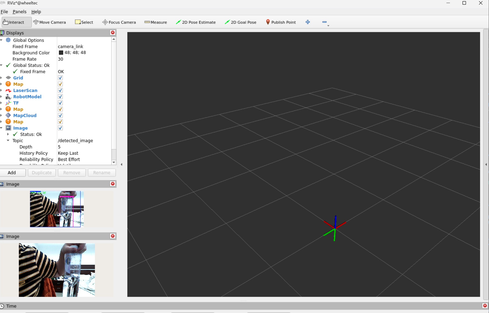

# Embodied AI Tracked Robot 

A high-performance tracked mobile robot built from scratch. Powered by Nvidia Orin Nano for edge AI computing and STM32 for low-level motor control, running on the ROS 2 ecosystem.

## Hardware Architecture
* High-Level Compute: Nvidia Orin Nano (Ubuntu 22.04 LTS)
* Low-Level Control: STM32F407 running FreeRTOS
* Actuation: Tracked chassis with DC gear motors & incremental encoders
* Sensors: Single-line 2D LiDAR, ICM20948 IMU

## Tech Stack
* Robotics & Control: ROS 2 (Humble) | Nav2 | PID Control | Kinematics
* AI & Vision (Planned): YOLOv8 | PyTorch | Nvidia TensorRT | OpenCV

## Project Status

-  Hardware assembly and wiring validation
-  Network configuration (SSH & static IP binding)
-  Initial ROS 2 workspace compilation
-  Bench testing (Suspension test): Teleop node and chassis driver communication verified
-  Ground testing and motor PID tuning
-  2D SLAM mapping using Cartographer
-  Autonomous navigation (Nav2) and YOLO deployment

> Dev Note (Day 0): > The system has successfully passed the bench suspension test. SSH connection between the host PC and Orin board is stable. Waiting for full battery charge before initiating physical ground testing.

## Current Project Status
Phase 1: Hardware integration and initial system deployment.

-  Hardware assembly and wiring validation
-  Network configuration (SSH & static IP binding)
-  Initial ROS 2 workspace compilation
-  Bench testing: Teleop node and chassis driver communication verified
-  Phase 1.5 (Vision Setup): Astra RGB-D Camera initialized; RGB and Depth streams strictly verified via RViz2.
-  Phase 2: Ground testing and motor PID tuning
-  Phase 3: 2D SLAM mapping using Cartographer
-  Phase 4: Autonomous navigation (Nav2) and YOLO deployment

## Phase 3: AI Vision & Target Detection (AI视觉与目标检测部署)
Status: Successfully Deployed
Hardware: Nvidia Orin Core & Astra RGB-D Camera
Algorithm: YOLOv8n (Ultralytics) running on ROS2 Humble

Milestones Achieved:
-  Offline Model Injection: Successfully bypassed local network constraints by injecting pre-trained `yolov8n.pt` weights via SFTP.
-  Pipeline Bridge: Established forced relay bridge from Astra RGB stream (`/camera/color/image_raw`) to YOLO detection node.
-  QoS Penetration: Resolved ROS2 Quality of Service (QoS) mismatch, shifting Reliability Policy to `Best Effort` for real-time inference rendering.
-  Visualization: Achieved real-time object detection with bounding boxes and confidence scores in RViz2 (`/detected_image`).

Deployment Result:

